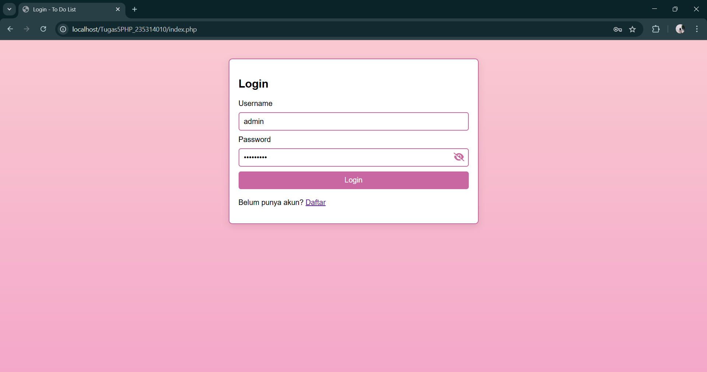

# Aplikasi To Do List

Aplikasi To Do ini dibuat untuk membantu kamu mengatur tugas harian dengan mudah. Kamu bisa bikin akun, login, dan mulai mengelola daftar tugas yang perlu diselesaikan. Dibuat dengan PHP dan menggunakan database MySQL.

## Fitur Utama

- Pendaftaran Pengguna
- Login Pengguna
- Menambah Tugas
- Mengedit Status Tugas
- Menghapus Tugas
- Tampilan Dashboard untuk Mengelola Tugas

## Antarmuka Pengguna

### Pendaftaran Pengguna
Proses pendaftaran untuk membuat akun pengguna baru.

- Tampilan Awal  
  

- Pendaftaran Gagal  
  

> *Catatan:* Jika pendaftaran berhasil, pengguna akan langsung diarahkan ke halaman login.

### Login Pengguna
Masuk dengan akun yang sudah terdaftar.

- Tampilan Login Awal  
  
  
- Login Gagal  
  

> *Catatan:* Jika login berhasil, pengguna akan langsung diarahkan ke halaman To Do.

### Dashboard To Do
Halaman utama aplikasi di mana pengguna dapat menambahkan, mengedit, dan menghapus tugas.

- Tampilan Dashboard  
  

- Menambahkan Tugas  
  

- Mengedit Status Tugas  
  

- Menghapus Tugas  
  

### Screenshot Database
Berikut adalah screenshot dari tabel *Pengguna (Users)* dan *Tugas (To Do)* yang digunakan dalam aplikasi ini:

- *Tabel Pengguna (Users)*  
  

- *Tabel Tugas (Todo)*  
  

Terima kasih telah melihat proyek saya! Semoga bermanfaat🫰
